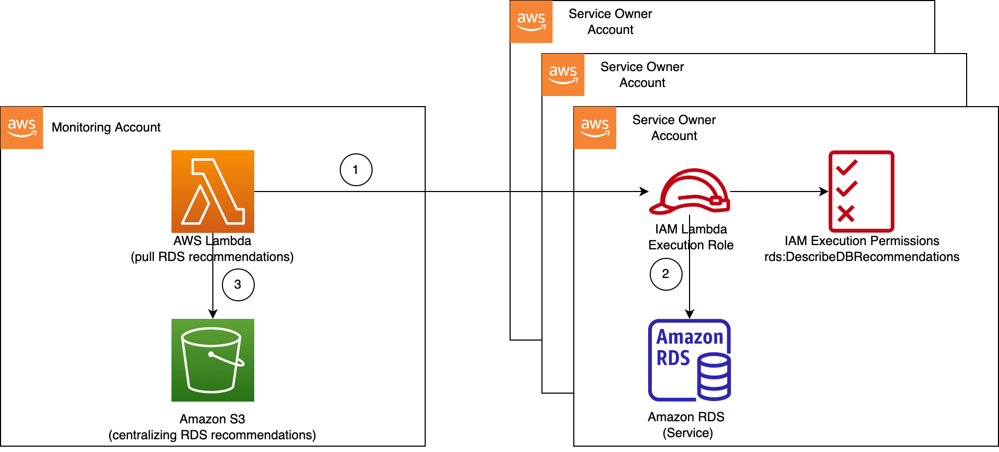

## Architecture



This respository provide a sample code to deploy a solution for collecting and centralizing Amazon RDS recommendations from service owner accounts within an organization. The deployment leverages CloudFormation stack set.

1. The Lambda function in the monitoring account assume role in a service owner account.

2. The Lambda function call Amazon RDS [DescribeDBRecommendations](https://docs.aws.amazon.com/AmazonRDS/latest/APIReference/API_DescribeDBRecommendations.html).

3. The Lambda function send recommendations in json format to a S3 bucket.

## Deploy

We use the CloudFormation stack set to deploy an IAM role with trusted policy into multiple accounts (service owner account) within an organization unit. Then the Lambda function in the monitoring account will assume this role to get Amazon RDS recommendations from each service owner account. Let following the below steps to deploy the solution: 

Step 1. Let clone this repository. 

```bash
git clone https://github.com/aws-samples/centralize-rds-recommendations-across-accounts.git
cd centralize-rds-recommendations-across-accounts/template/
```

Step 2. Deploy a Lambda function in **monitoring account**.

```bash
aws cloudformation create-stack \
 --stack-name cf-lambda-for-centralize-rds-recommendations \
 --template-body file://cf-lambda.yaml \
 --parameters '{"TargetAccountIds":"<TARGET_ACOCUNT_ID_1>,<TARGET_ACCOUNT_ID_2>"}'
 --capabilities CAPABILITY_NAMED_IAM
```

Step 3. Create a CloudFormation stack-set in **management account**.

```bash
aws cloudformation create-stack-set \
 --stack-set-name cf-iam-role-for-centralize-rds-recommendations \
 --permission-model SERVICE_MANAGED \
 --auto-deployment '{"Enabled":true,"RetainStacksOnAccountRemoval":false}' \
 --template-body file://cf-iam-role.yaml \
 --parameters '{"ParameterKey": "ServiceRoleArn", "ParameterValue": "arn:aws:iam::<MONITOR_ACCOUNT_ID>:role/LambdaGetRDSRecommendationsRole"}' \
 --capabilities CAPABILITY_NAMED_IAM
```

Step 4. Create stack instances targeting accounts within **an organization unit**.

```bash
aws cloudformation create-stack-instances \
 --stack-set-name cf-iam-role-for-centralize-rds-recommendations \
 --deployment-targets '{"OrganizationalUnitIds":["<OU_ID>"]}' \
 --regions ap-southeast-1 \
 --operation-preferences FailureToleranceCount=0,MaxConcurrentCount=1
```
